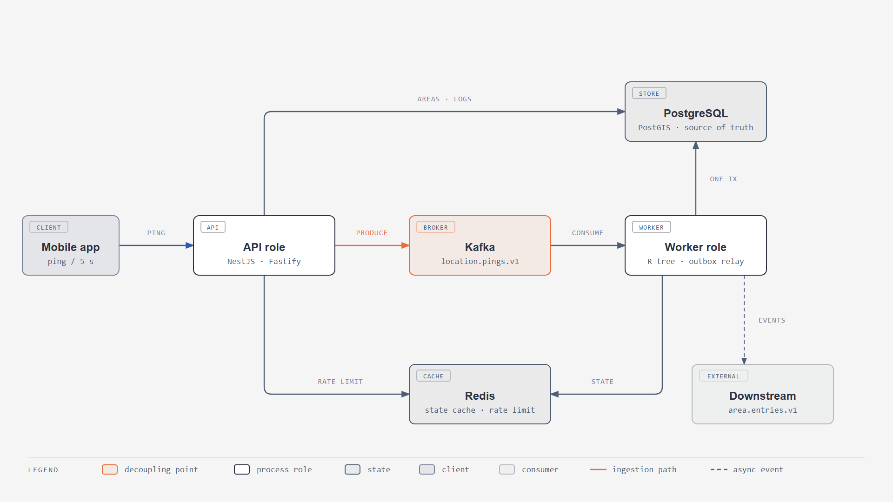
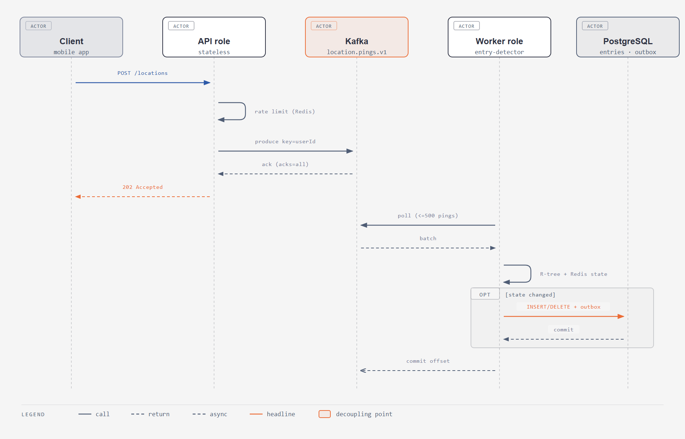
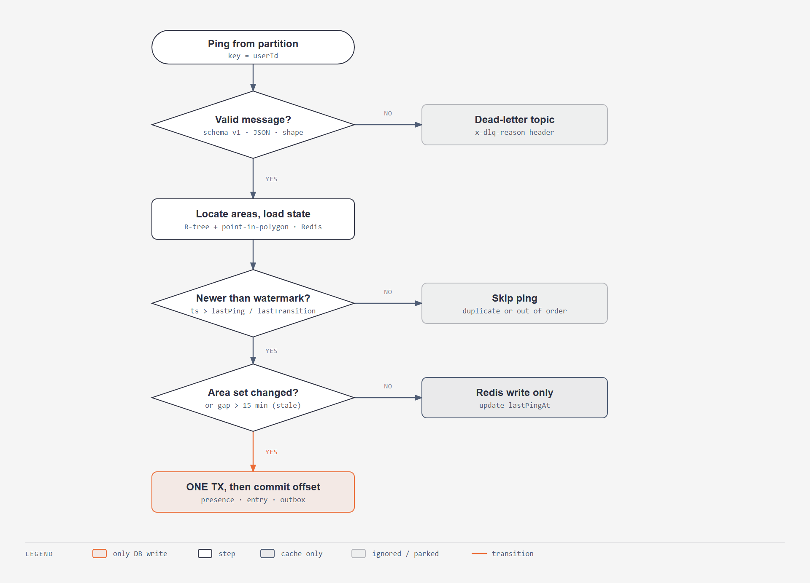
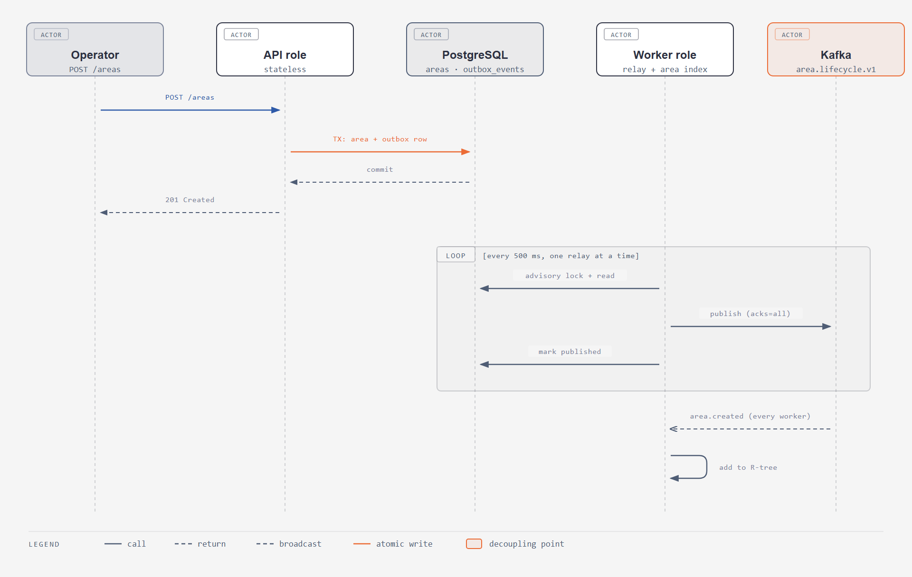

# Diagrams

Generated with the `diagram-design` skill. The PNGs are for reading (they render on GitHub); the editable HTML/SVG sources are in [`src/`](src/).

## Architecture

## From ping to log entry

## Worker: what one ping can do

## New area to worker index (outbox)

